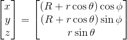
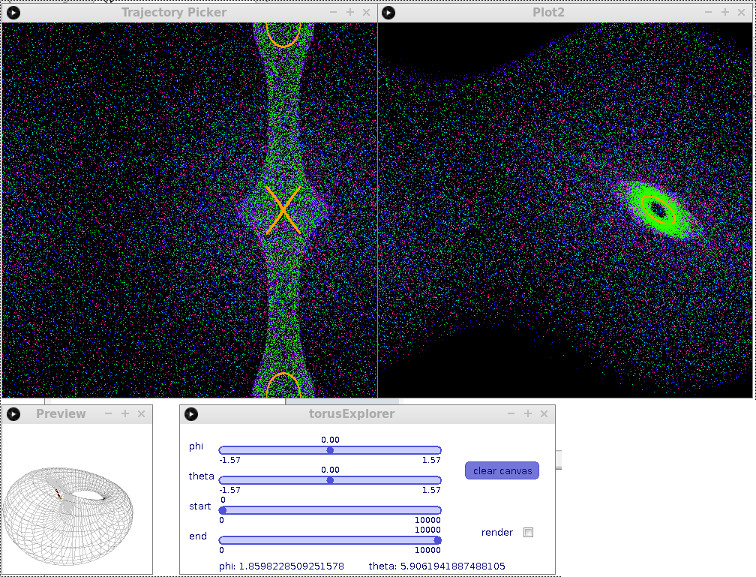
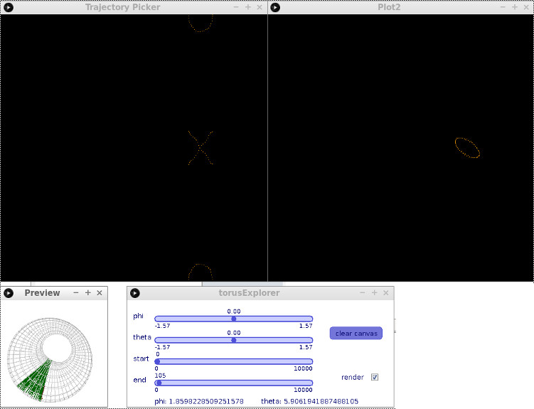

# TorusBounces

This is a tool for simulating the trajectory of a particle inside of a deformed torus. The Processing applet allows for interactive exploration of the results for different initial conditions.

### Conventions

The parametrization is given by

The outer and inner radii, R and r, can themselves be functions of (phi) and (phi, theta), respectively, allowing for deformed toruses. See below for how to modify the functions used in the program.

In our coordinate system, phi is the azimuthal angle, and positive changes in phi correspond to counter-clockwise motion viewed from the +Z direction (starting in the +X direction).

Theta is the inner angle, traversing the cross-section of the torus. Theta is zero on the outside of the torus and pi on the inside of the torus.

### Usage

The two large windows are plots of the points where the particle hits the torus given some initial condition. The left plot shows the positions in toroidal coordinates, and the right shows azumuthal angular momentum versus azimuthal angle of the hit point. Clicking in the left window will generate a new scatter plot with the initial conditions determined by your mouse position (x = phi, y = theta). The corresponding position inside the torus appears in the 3D preview.

The first two sliders in the settings window allow you to change the initial launch direction with respect to the surface normal (also shown in the 3D preview). The last two pertain to the detailed analysis feature, which renders the trajectory in the 3D preview, starting and ending at the specified bounces if the "render" checkbox is selected.

When this mode is active, only the active trajectory will be shown in the scatter plots, and you can isolate any interesting behavior you see by adjusting the start and end sliders.

To modify the torus, edit the `R(phi)`, `r(phi, theta)`, `dRdphi(phi)`, `drdphi(phi, theta)`, and `drdtheta(phi, theta)` functions. Note that the latter three must be correct partial derivatives of `R` and `r`.

### Dependencies:
- The Julia code depends on the Plots.jl package.
- The Processing applet depends on the G4P library for user interface widgets.
